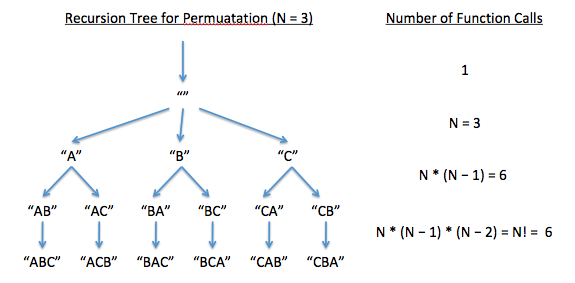

## When memoizing (caching function results) doesn't help

Memoizing does not speed up the process of generating permutations recursively. When the `permute` function calls itself (as it does e * n! times), it never passes the same partial or fully formed permutation string twice. It's designed not to as it uses a branching tree to continually vary `current_str`. Therefore no memoized/cached value is ever accessed to evaluate any function call. Every function call must actually run, so there is no benefit to memoizing.

This stands in contrast to recursive algorithms that depend on induction (like the Fibonacci sequence), which frequently re-evaluate function calls with the same arguments.  With memoization, the results of these calls can be looked up after being calculated once (rather than re-running the function), saving significant computation time.

## Time complexity and number of function calls

As widely noted, there are N! permutations of N distinct elements, so any algorithm - recursive or not - will be very slow to finish (at least O(N!)) when N is large.  But how much worse than that might it be for our particular code?  For that we have to at least count the number times the `permute` function is called. We'll assume that the function can be written so that each pass through only does one operation so that the count of `permute` function calls is proportional to computational complexity.  (In reality, the set operations often performed by `permute` would add up to N computations for each pass.)

To count the function calls, we make a diagram:

Each arrow represents a call of the `permute` function.  The string at the base of the arrow is the value of `current_str` passed into the function, the calling of which generates more values for `current_str`, which are passed into more arrows until the values are full-length permutations of the original string (the leaf nodes at the bottom).

If our N-ary tree were perfect (meaning that within each level every node has either zerp or N children, and that all leaf nodes are at the same depth), we would have [formulas](https://en.wikipedia.org/wiki/K-ary_tree) for the number of nodes and the height of the tree.  (Our tree has nodes with 2, which is neither N nor zero, children.) A perfect binary tree (see [properties](https://en.wikipedia.org/wiki/Binary_tree)) would have height equal to log base 2 of the number of leaves.  Since there are 2^N leaves, the height is N.  The number of nodes is the sum of a geometric series equal to 2^(N+1) - 1.

Our tree has N! leaf nodes and height N (an inverse factorial rather than a log determines the height).  By inspecting the diagram, we see that the total number of function calls is `1 + N + N(N-1) + N(N-1)(N-2) ... + N(N-1)(N-2)...(3) + N(N-1)(N-2)...(2) + N!`.

This is good to know, but how many function calls is that per permutation generated?  Since there are N! permutations in the bottom row of the tree, we divide by N! and get `1/N! + 1/(N-1)! + 1/(N-2)! + 1/(N-3)! ... + 1/2 + 1/1 + 1/1`.  It's written backwards perhaps, but this series (sum of 1/i! where i ranges from 0 to N) approaches e as N gets large.  (In fact it's pretty close to e even when N is small.)

This constant ratio (e) between number of nodes and number of leaves in a tree is analogous to the binary-tree case where the ratio would be (see above) (2^(N+1) - 1)/(2^N).  This is 2 - 1/(2^N), which clearly approaches 2 as N gets large.
